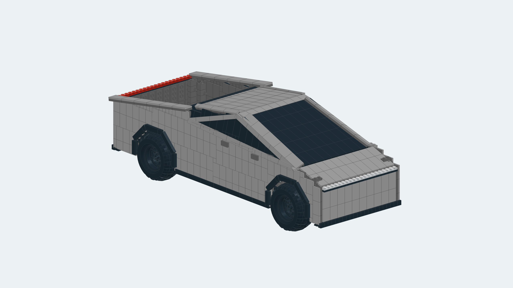

# LEGO Builder

A local OBJ-to-LEGO research converter. The general workflow extracts an approximate exterior envelope, ignores enclosed interior geometry and fits real LEGO bricks, plates, tiles and slopes. It exports a canonical model, `.ldr`, exact inventory and an interactive preview rendered from actual LDraw parts. It uses geometry rather than filenames, object labels or a vehicle template.

The outputs are **digital candidates**. Artifact and catalog checks do not establish collision-free connections, stability or physical buildability. General sculptural results are still visibly stepped; uniformly polished results for arbitrary objects remain an engineering goal.

The unified [image-to-LDraw workspace](reconstruction-site/README.md) combines photo reconstruction, saved OBJ requests, converter execution and LDraw model/parts inspection. The Python service is packaged separately because Sites cannot execute its native geometry dependencies. See [demo submission setup](docs/SUBMISSION.md) for deployment, configuration and the manual fallback. The original [Sites UI preview](site/README.md) remains available as a separate design prototype.

## Install and convert an OBJ

Requires Python 3.11 or newer. Run from the repository root:

```sh
python3.11 -m venv .venv
.venv/bin/python -m pip install -e '.[test]'
.venv/bin/python -m lego_builder convert-obj path/to/object.obj --target-parts 2000 --up y --output outputs/my-object
.venv/bin/python -m lego_builder validate outputs/my-object
```

Choose the source's upright axis with `--up x|y|z` (default `y`; the supplied cat uses `z`). The piece target adjusts physical size through a bounded deterministic search; it is not an exact count or fixed size promise. The target band is ±10%, capped at 10,000 pieces; the report states whether the best candidate reaches it. Existing output directories are never overwritten. Exit `0` means the digital artifact checks passed; it does not mean the target band or mechanical checks passed. Rejected conversions return `2` and diagnostics.

A reviewed subset of official LDraw geometry and manufactured part/color evidence is bundled, so conversion and previews need no network access. The recursive loader can search and render a full official LDraw library; the fitter currently selects parts for which placement rules and color evidence are implemented. Adding catalog files alone does not supply a geometric fitting or connection rule. See [catalog provenance](lego_builder/data/README.md).

## Results to inspect

- [Detailed Cybertruck LDraw](examples/cybertruck/model.ldr): **2,069 pieces, 23 part types**, approximately **52 × 20 × 17 cm**. This separate source-specific panel fitter uses the supplied OBJ's exterior groups and dimensions to produce smooth body panels, dark glazing, real tires/rims, angular arches, an open bed and light bars. It is an explicit refinement experiment, not the general algorithm.
- [Generic OBJ examples](examples/generic/README.md): cat, procedural bottle, procedural rounded object and the same Cybertruck through the shared geometry-only converter. Each result has its own LDraw, inventory, preview and source-bound diagnostics.
- [Cybertruck inspection and reproduction](examples/cybertruck/README.md), [independent QA](docs/qa-cybertruck.md).



Reproduce the detailed Cybertruck candidate in a new directory:

```sh
.venv/bin/python -m lego_builder convert-exterior references/3d-objects/cybertruck.obj --length 64 --tire 45982 --side-tile-length 3 --output outputs/cybertruck-detailed
```

## Output contract

| File | Contents |
| --- | --- |
| `model.json` | Revision-bound part IDs, colors, native LDraw transforms, source hash, target constraints and catalog evidence |
| `model.ldr` | Standard type-1 part references; open in BrickLink Studio or a complete LDraw viewer |
| `bom.json`, `bom.csv` | Exact quantities by part and color from the same placements |
| `sequence.json` | Component index; **not validated building instructions** |
| `preview.html` | Standalone WebGL viewer with orbit, zoom, standard views and PNG export using actual part geometry |
| `validation.json` | Digital checks, actual count, target-band result and explicit unevaluated mechanical states |

Open `preview.html` directly in a browser. Its geometry, attribution and shaders are embedded; there are no remote scripts or services. Renderer limitations include approximate transparency, no image textures and no conditional edge evaluation. Preview and LDraw share the same rigid transforms and immutable model revision. Publication stages the complete bundle before exposing the result directory.

## General exterior conversion boundary

The OBJ reader consumes vertices/faces and ignores material paths, normals, textures and semantic group names. It preserves the source file, merges coincident vertices and removes degenerate/duplicate faces. A triangle-box raster, bounded gap closing and exterior flood fill infer an occupied envelope; fitting retains a thin shell rather than reproducing enclosed internal interfaces. No convex-hull substitution, hidden vehicle routing, external stand or count-padding blocks are used.

The shell uses a physical grid of one stud horizontally and one plate vertically. Exposed top cells receive tiles; suitable shoulder regions receive real slopes. All generic parts currently use Light Bluish Gray. Internal geometry exposed through large holes can remain visible to the envelope process, and one-cell repair can bridge small exterior gaps. Open sheets, separate components and overhangs can remain mechanically disconnected. Arbitrary mesh repair and automatic mechanical validation remain unresolved.

Resource limits are 80 MiB, 300,000 triangulated faces, 500,000 grid cells and 10,000 output parts. The default search tries at most five scales between 12 and 96 studs. Malformed or unusable meshes fail with diagnostics. Source-raster silhouette overlap and sampled distance to continuous source triangles describe envelope fidelity, **not artistic resemblance or final part-surface accuracy**.

## Verify and benchmark

```sh
.venv/bin/python -m pytest -q
.venv/bin/python -m benchmarks.exterior --output outputs/exterior-benchmark
```

The exterior benchmark uses the same public conversion entry point for four distinct geometries. It renames a byte-identical copy of the Cybertruck at runtime, labels procedural fixtures, and records revisions, provenance, piece counts and limits. Regression checks include enclosed-interior invariance, filename/group independence, asymmetric part transforms, proper rotations, catalog/color evidence, tamper rejection and atomic publication failures.

To use a complete official library, inspect `scripts/fetch_ldraw_library.py --help`, download it to a new directory and pass its `ldraw` root through `--library`. The script bounds archive extraction and records upstream hashes/licenses; the full archive is not vendored.

## Earlier rectangular prototype

The existing `convert` command remains available for closed OBJ/STL meshes with twelve rectangular red brick/plate families and conservative stud/socket, collision, connectivity and insertion-order checks. Its schematic preview and bottom-up sequence use the original schema, separate from the new native-LDraw exterior candidate contract.

```sh
.venv/bin/python -m lego_builder convert references/3d-objects/cat/12221_Cat_v1_l3.obj --size 8 --up z --output outputs/cat-legacy
.venv/bin/python -m benchmarks.run --output outputs/legacy-benchmark --sizes 8 12 16 24
```

The [recorded 44-candidate legacy run](benchmarks/results/README.md) produced 26 automated-valid candidates and 18 diagnostic-only failures. Its restricted geometry checks do not transfer to the new mixed-part exterior workflow, and neither path has physical assembly evidence.

## Product and collaboration

- [Roadmap](Roadmap.md): scope, phases and release gates.
- [Product](Product.md): outcomes, acceptance criteria and reference decisions.
- [Architecture](Architecture.md): geometry, schema and pipeline contracts.
- [AGENTS](AGENTS.md): roles and branch/review policy.
- [References](references/README.md): source assets and provenance.
- [Conversion research](research/image_to_brick_model_research.docx): approach and tool choices.
- [Role briefs](agents/): engineering responsibilities and handoffs.

Keep `main` stable. Work on feature branches and use partner-reviewed pull requests. The primary integrator owns commits and pushes; role agents hand off edits and verification evidence.
